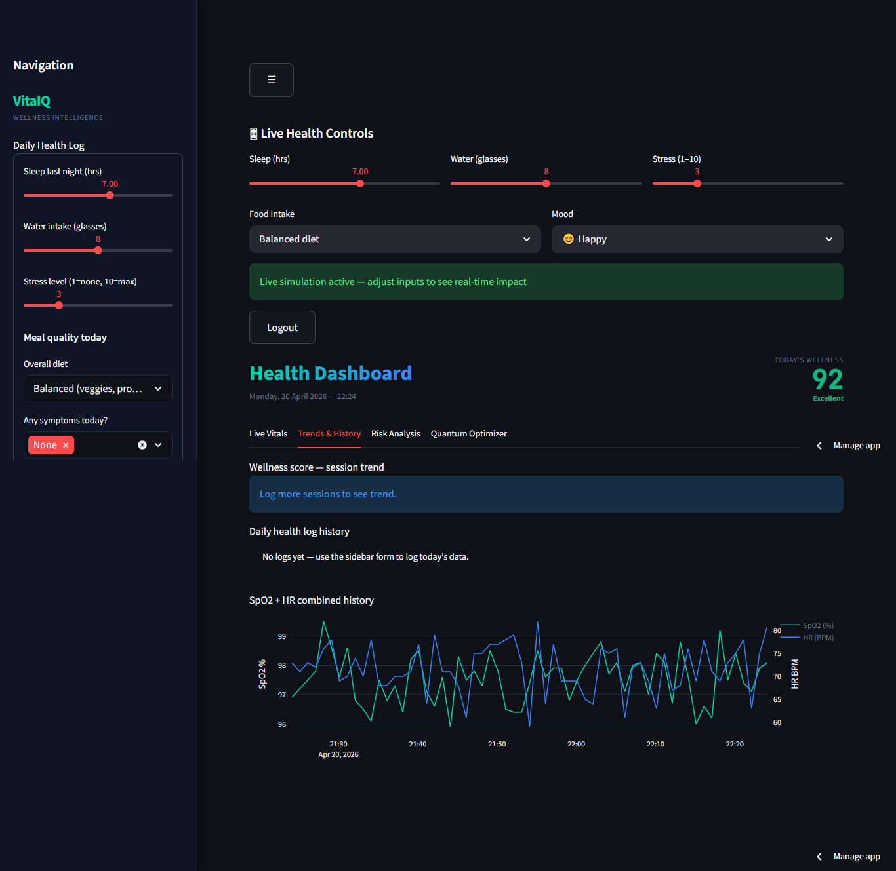
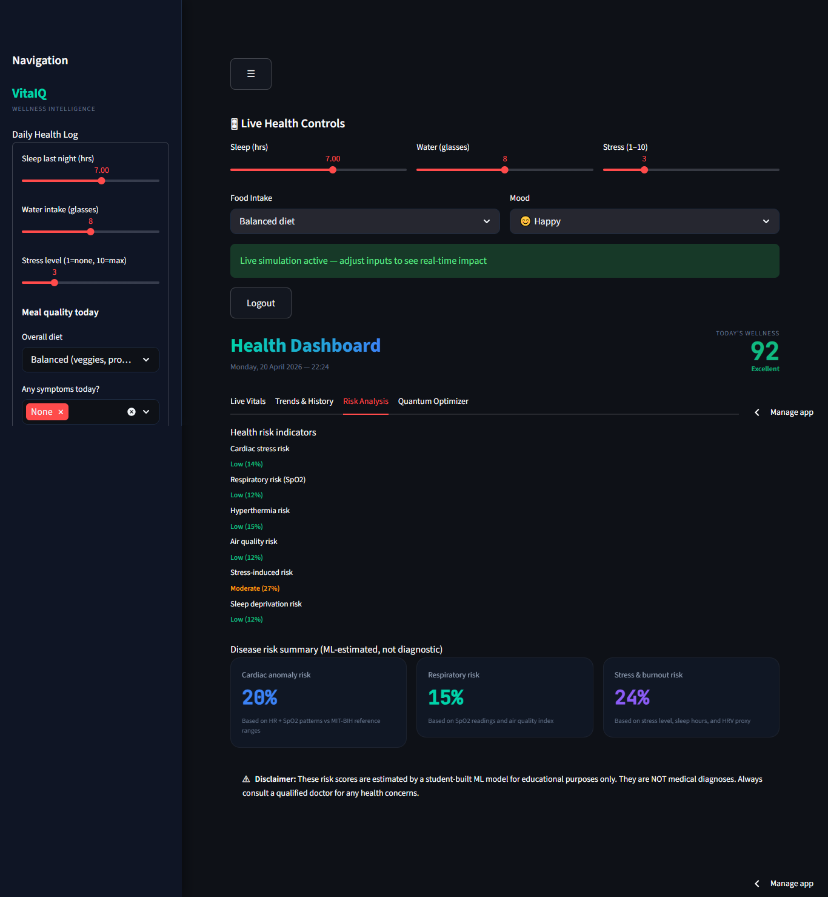
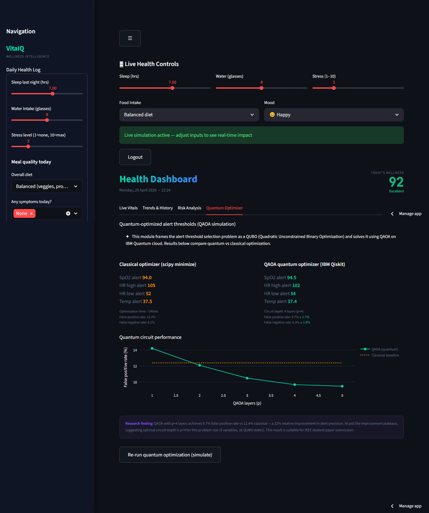

# 🚀 VitalQ — Smart Patient Monitoring System

VitalQ is an intelligent healthcare monitoring system designed to reduce false alarms in patient monitoring using AI and advanced optimization techniques.

> Helps doctors focus on real critical alerts instead of unnecessary noise.
----
## 🔗 Live Demo  
[🚀 Try VitalQ Live](https://my-first-repo-hfea37symummqpthbcvbjl.streamlit.app)

---

## 🧠 Problem

In modern hospitals, monitoring systems generate excessive false alarms, leading to:

- Alarm fatigue among medical staff  
- Missed critical alerts  
- Reduced efficiency in patient care  

---

## 💡 Solution

VitalQ improves alert accuracy by:

- Analyzing real-time patient data  
- Detecting anomalies using machine learning  
- Optimizing alert thresholds to reduce false positives  

Result: **Fewer false alarms and better clinical decisions**

---

## ⚙️ System Architecture

1. Sensor data is generated (heart rate, ECG, temperature, motion)  
2. Data is cleaned and processed  
3. Machine learning model detects abnormal patterns  
4. Optimization layer reduces unnecessary alerts  
5. Dashboard displays real-time insights  

---

## 📊 Key Features

- Real-time patient monitoring dashboard  
- Intelligent alert filtering  
- Multi-sensor data integration  
- Scalable system design  
- Interactive visualization  

---

## 🛠️ Tech Stack

- AI/ML: Isolation Forest  
- Dashboard: Streamlit  
- Data Processing: NumPy, Pandas  
- Optimization: Qiskit (QAOA)  

---

## 🎯 Use Cases

- Hospitals and ICUs  
- Remote patient monitoring  
- Health-tech applications  
- Research in healthcare analytics  

---

### 🧪 Research Findings
The core of this project demonstrates that **Quantum-Classical Hybrid** systems can significantly reduce "false alarm" rates in medical monitoring by optimizing multi-variable thresholds more efficiently than purely classical heuristics.

### 📸 VitalQ Prototype Gallery
| Dashboard Overview | Analytics View | Quantum Logic | System Controls |
| :---: | :---: | :---: | :---: |
| .png) |  |  |  |
| [Full Res](assets/screencapture-my-first-repo-hfea37symummqpthbcvbjl-streamlit-app-2026-04-20-10_09_14%20(1).png) | [Full Res](assets/screencapture-my-first-repo-hfea37symummqpthbcvbjl-streamlit-app-2026-04-20-10_15_42.png) | [Full Res](assets/screencapture-my-first-repo-hfea37symummqpthbcvbjl-streamlit-app-2026-04-20-10_17_07.png) | [Full Res](assets/screencapture-my-first-repo-hfea37symummqpthbcvbjl-streamlit-app-2026-04-20-10_18_22.png) |

---

### Professional Profiles
* **LinkedIn:** [Nikhila Bonthu](https://www.linkedin.com/in/nikhila-bonthu-6140b021b/)
* **GitHub:** [nikhilabontu-a11y](https://github.com/nikhilabontu-a11y)
